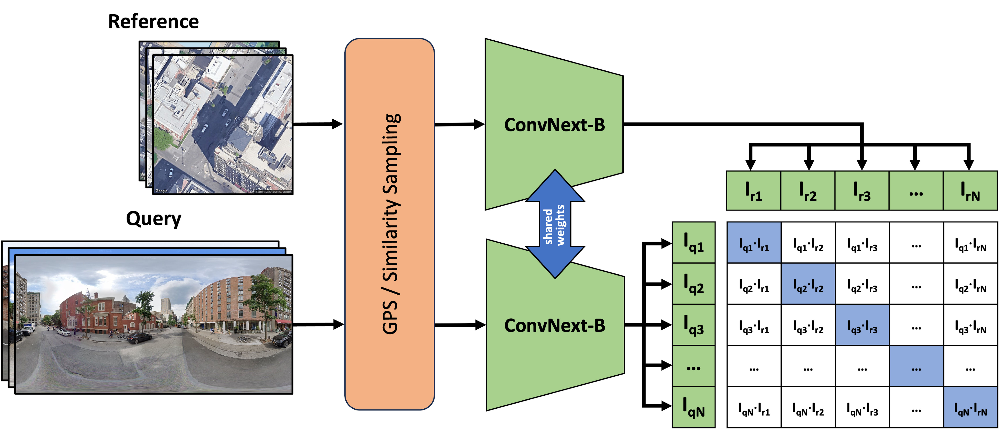

# Sample4Geo: Hard Negative Sampling For Cross-View Geo-Localisation

In this repository we present our ICCV accepted work: "Sample4Geo: Hard Negative Sampling For Cross-View Geo-Localisation" and provide training and inference code. 

[](https://paperswithcode.com/sota/image-based-localization-on-vigor-same-area?p=sample4geo-hard-negative-sampling-for-cross)

[](https://paperswithcode.com/sota/image-based-localization-on-vigor-cross-area?p=sample4geo-hard-negative-sampling-for-cross)

[](https://paperswithcode.com/sota/image-based-localization-on-cvusa-1?p=sample4geo-hard-negative-sampling-for-cross)

[](https://paperswithcode.com/sota/image-based-localization-on-cvact?p=sample4geo-hard-negative-sampling-for-cross)

[](https://paperswithcode.com/sota/drone-view-target-localization-on-university-1?p=sample4geo-hard-negative-sampling-for-cross)


[Paper](https://arxiv.org/abs/2303.11851) 

[Weights](https://drive.google.com/drive/folders/1PMuUqvDnCb216D8_ZDDJzDD3FxeH5BoA?usp=drive_link)


*Sample4Geo Architecture*

> Cross-View Geo-Localisation is still a challenging task where additional modules, specific pre-processing or zooming strategies are necessary to determine accurate positions of images. Since different views have different geometries, pre-processing like polar transformation helps to merge them. However, this results in distorted images which then have to be rectified. Adding hard negatives to the training batch could improve the overall performance but with the default loss functions in geo-localisation it is difficult to include them. In this article, we present a simplified but effective architecture based on contrastive learning with symmetric InfoNCE loss that outperforms current state-of-the-art results. Our framework consists of a narrow training pipeline that eliminates the need of using aggregation modules, avoids further pre-processing steps and even increases the generalisation capability of the model to unknown regions. We introduce two types of sampling strategies for hard negatives. The first explicitly exploits geographically neighboring locations to provide a good starting point. The second leverages the visual similarity between the image embeddings in order to mine hard negative samples. Our work shows excellent performance on common cross-view datasets like CVUSA, CVACT, University-1652 and VIGOR. A comparison between cross-area and same-area settings demonstrate the good generalisation capability of our model. 


For training and testing the provided code download the datasets and extract them as shown in the folder structure. Before training the dataset depending calc\_distance script has to be executed to generate the distances based on the GPS locations. 
Afterwards for each dataset a unique train script can be executed. The pre-trained weights should be extracted into the folder pretrained to run the eval scripts.

We provide a requirements.txt file to ensure compatibility.

## Folder Structure:

```
├─ Sample4Geo
  ├── pretrained/
  ├── data/
    ├── U1652/
    ├── VIGOR/ 
    ├── CVUSA/	
    └── CVACT/
  └──sample4geo/

```


